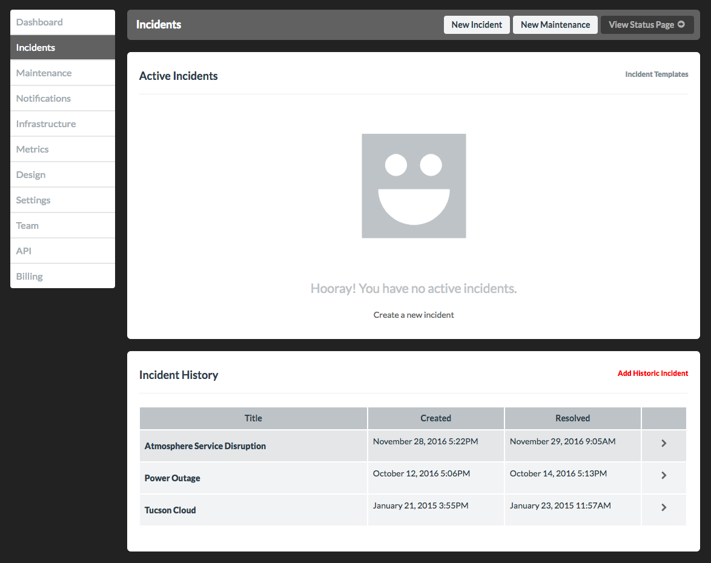
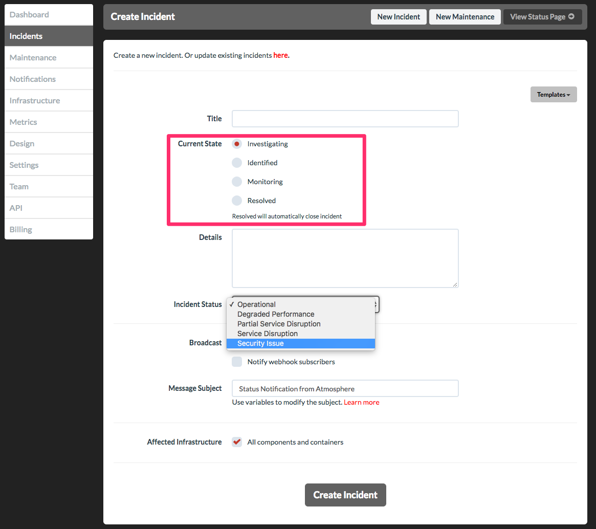
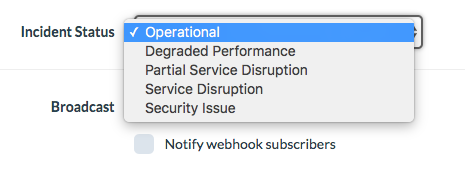
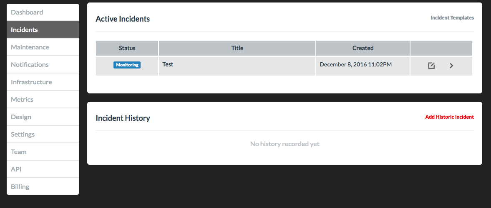
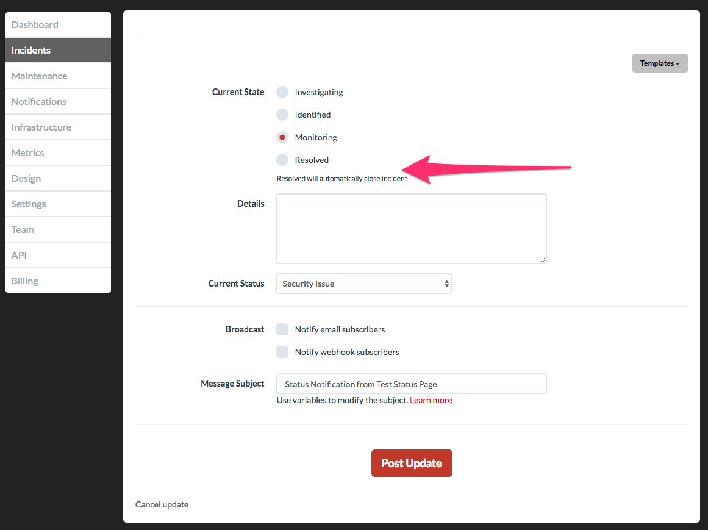
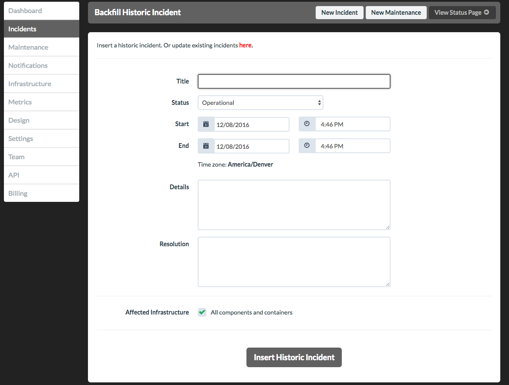

# `status.io` - Incidents

## Background

"Incidents" cover a range of events. They could be defined by the fact that they're **not** _Maintenance_. If a server is running slow, unreachable for a geographic range, unavailable due to being off-line for a security patch, or just plain non-functional - it is an incident. Creating, updating, and resolving incidents allows the community to see what is going on and adjust their expectations accordingly.

## Creating an Incident

Visit the Incidents page. You'll see any active incidents along with other options for creating incidents (like adding a history incident). 

When creating an incident, you want to use the "Current State" to signal where the operations team is with handling the incident:

**Note: you can specific all the components/containers, or just those affected.**

**Aside:** you can create templates for incidents to make the messaging of an incident more _uniform_ across the organization.

In helping communication expectations, a "status" can also be selected to communicate the availability. 

## Updating an Incident

As the operations moves from _Investigating_ to _Identified_, or _Investigating_ to _Monitoring_, we can update an incident. 

Go to the incidents view, and click the "pencil" + "box" icon:

The new State, Details, and Status will be provided on the status.io site (or, optionally broadcast via email or webhook).

## Resolving an Incident

If you wish to _resolve_ an Incident, just mark the "Current State" as "Resolved".

## Adding a historic Incident

If a status has been identified and resolved without noting it via `status.io`. It can be added after the occurrence:

