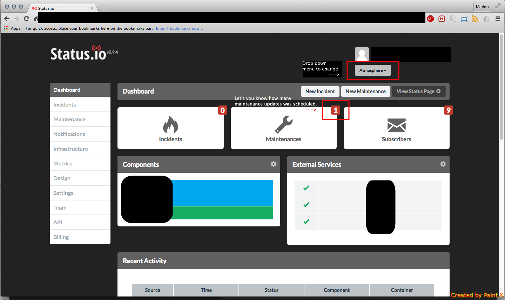
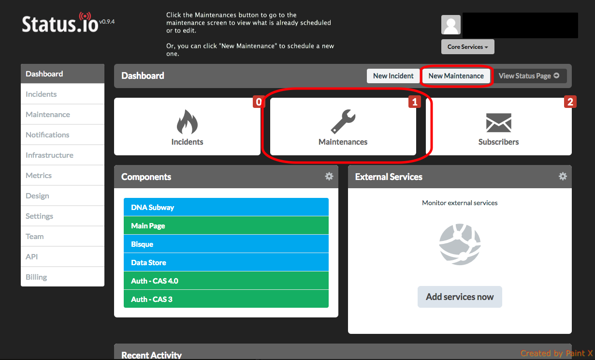

# `status.io` Status
## Setting Maintenance

### Creating a Maintenace

1. Go to <http://status.io> and login using CyVerse/iPlant credentials
2. Navigate to each product in the drop-down menu on the Dashboard (Upper right-hand corner)

3. To set a automated Maintenance, select `New Maintenance` and add a brief description of the maintenance

4. Set a time and date

5. Select services to put into maintenance

Note: a Status.io now offers "automation" for the "start" & "finish" states in a Maintenance. You have the option to turn this on with creating a maintenance. See their [Knowledge Base for more information](http://kb.status.io/planned-maintenance/maintenance-lifecycle/). 

### Updating a Maintenance

Periodic updates can be made to a Maintenance. This may be helpful if an issue has been encountered that may delay the completion of Maintenance. 

### Resolving/Clearing a Maintenance

Without using "automation", a Maintenance will need for be resolved, or cleared. 

