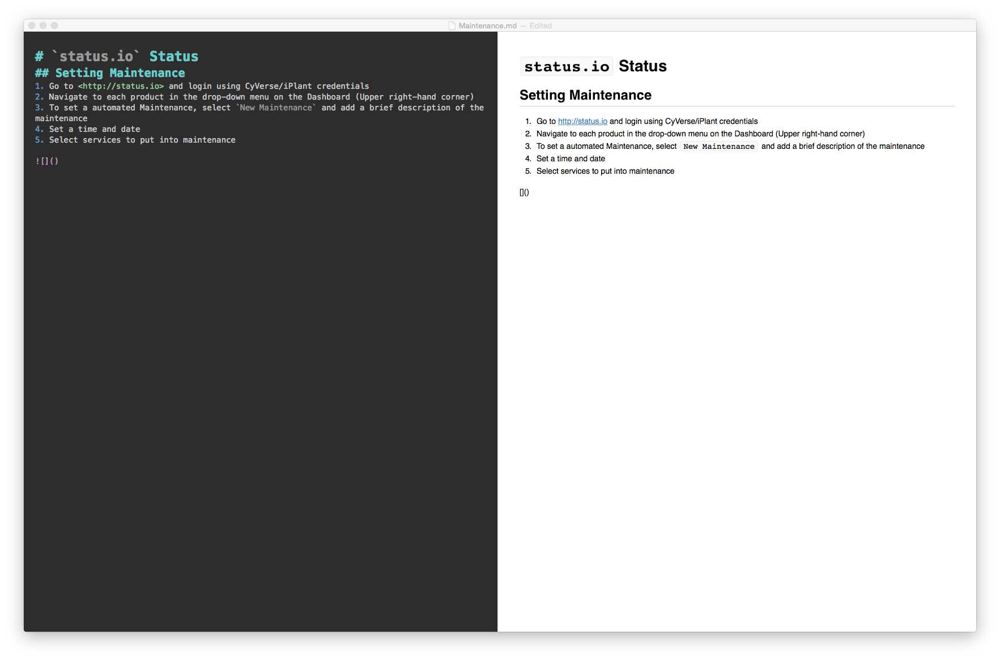

# `status.io` Status
## Setting Maintenance
1. Go to <http://status.io> and login using CyVerse/iPlant credentials
2. Navigate to each product in the drop-down menu on the Dashboard (Upper right-hand corner)
3. To set a automated Maintenance, select `New Maintenance` and add a brief description of the maintenance
4. Set a time and date
5. Select services to put into maintenance

